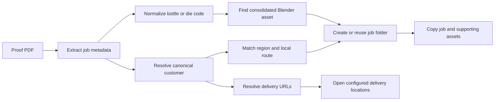

# Blender Production Automation

[](https://github.com/Elia-Youssef/blender-production-automation/actions/workflows/ci.yml)
[](https://www.python.org/)
[](LICENSE)

A configurable Python toolkit for automating asset-heavy Blender production
workflows—from extracting job metadata from proof PDFs to routing work, locating
the correct `.blend` asset, and preparing production folders.

This project grew from a real production bottleneck: high-volume product-render
work requires coordinating proof documents, customer naming variations, regional
folders, reusable Blender assets, and delivery locations. The toolkit turns those
repetitive decisions into a deterministic, testable workflow.

## What it demonstrates

- Metadata extraction with two PDF-parser strategies
- Region-aware customer and route matching
- Structured mapping between customers, assets, and delivery locations
- Specialized box and pouch die-code detection
- Deterministic Blender asset lookup with normalized bottle identifiers
- Safe, preview-first batch file operations
- Migration from a production script to an installable, testable package
- Privacy-aware configuration, automated tests, linting, and CI

## Workflow



## Privacy by design

The public repository contains only fictional examples. Real production values
belong in ignored local files:

- `config/settings.local.json`
- `config/local/customer_urls.json`
- `config/local/customers_map.json`
- `config/local/library_routes.json`

The package can point `data_folder` at an existing private configuration directory,
so adopting the public package does not require moving production data.

Blender files, renders, proof PDFs, labels, source artwork, private URLs, audit
reports, and customer-specific paths are excluded from version control.

## Requirements

- Python 3.10 or newer
- Windows for Explorer, Chrome, and Photoshop integration
- Adobe Photoshop for the optional JSX/PowerShell batch workflow
- Blender assets stored outside this repository

The parsing and matching modules are platform-independent and tested on Windows
and Linux.

## Installation

```powershell
git clone https://github.com/Elia-Youssef/blender-production-automation.git
cd blender-production-automation
python -m venv .venv
.\.venv\Scripts\Activate.ps1
python -m pip install --upgrade pip
python -m pip install -e ".[dev]"
```

## Configuration

Copy the public examples into ignored local files:

```powershell
New-Item -ItemType Directory -Force config\local
Copy-Item config\examples\*.json config\local\
Copy-Item config\settings.example.json config\settings.local.json
```

Edit `config/settings.local.json` for your workstation. Paths may be absolute or
relative to the settings file. The settings file supports:

- Inbox and production-library roots
- A private mapping-data directory
- Any number of canonical customer-to-bottle-library mappings
- Optional default and always-open URLs
- Copy, matching, PDF-selection, logging, and HDRI preferences

You can also select a different settings file without modifying the repository:

```powershell
$env:BPA_SETTINGS_FILE = "C:\private\production-settings.json"
```

Validate settings and all three mapping files before running:

```powershell
blender-production-automation validate-config
```

## Usage

Run the production workflow:

```powershell
blender-production-automation run
```

Inspect immediate child-folder sizes:

```powershell
blender-production-automation folder-sizes "D:\AssetLibrary" --min-mb 500
```

Preview a collision-safe sequential image rename:

```powershell
blender-production-automation rename-images "D:\Job\Renders" --prefix "job-"
```

Apply the reviewed rename plan explicitly:

```powershell
blender-production-automation rename-images "D:\Job\Renders" --prefix "job-" --apply
```

## Configuration model

Three JSON files keep production data separate from workflow logic:

1. `customers_map.json` maps raw PDF customer text to canonical parent names.
2. `customer_urls.json` maps canonical customers and bottle keys to delivery locations.
3. `library_routes.json` maps customer aliases to local production roots.

The fictional files in [`config/examples`](config/examples) document the expected
schemas without exposing real customer information.

## Photoshop integration

The [`photoshop`](photoshop) directory contains a PowerShell and ExtendScript
workflow that processes transparent 4000×4000 PNGs through Photoshop:

- Resize visible artwork to a 3600-pixel longest edge
- Center it on the canvas
- Preserve the transparent PNG
- Produce a JPG with a white background

This integration is intentionally separate from the Python package because it
depends on Windows COM and an installed Photoshop application.

## Development

```powershell
python -m ruff format .
python -m ruff check .
python -m pytest
```

CI runs formatting, linting, and tests on Windows and Linux across the oldest and
newest supported Python versions.

See [CONTRIBUTING.md](CONTRIBUTING.md) for development expectations and
[SECURITY.md](SECURITY.md) for private vulnerability reporting.

## Roadmap

- Dry-run support for the complete production workflow
- JSON Schema files and richer configuration diagnostics
- Structured operation reports for auditability
- Optional Blender-side validation through `bpy`
- Additional fixtures for proof-document variants

## License

Released under the [MIT License](LICENSE).
